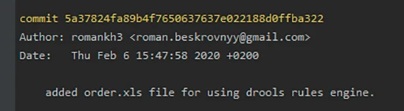

[к содержанию](./readme.md)

## Коммиты
 
 Основы работы с Git предполагают понимание коммитов. Команда ``git commit`` откроет текстовый редактор для ввода сообщения коммита. Также эта команда принимает несколько аргументов:
  

 - _-m_ позволяет написать сообщение вместе с командой, не открывая редактор. Например ``git commit -m "Пофиксил баг"``
  

 - _-a_ переносит все отслеживаемые файлы в область подготовленных файлов и включает их в коммит (позволяет пропустить ``git add`` перед коммитом);
  

 - _--amend_ заменяет последний коммит новым изменённым коммитом, что бывает полезно, если вы неправильно набрали сообщение последнего коммита или забыли включить в него какие-то файлы.
  
  Также у коммита есть еще своя информация, так называемые метаданные:
* уникальный идентификатор коммита, по которому можно его найти;
* имя автора коммита, который создал его;
* дата создания коммита;
* комментарий, который описывает, что было сделано во время этого коммита.
 
### Пример commit: 
 
  

 
 ### **P.S.** _Не стоит после каждого изменения файла делать commit. Чаще всего их создают, когда:_

Создан новый функционал

- Добавлен новый блок на верстке

- Исправлены ошибки по коду

- Вы завершили рабочий день и хотите сохранить код

_Это поможет держать вашу ветки в чистоте и порядке. Тем самым, вы будете видеть историю изменений по каждому нововведению в вашем проекте, а не по каждому файлу._
