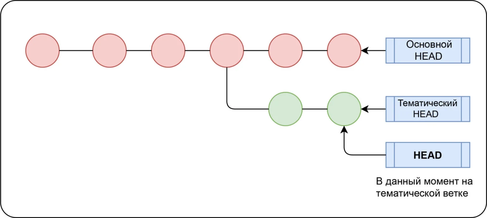

[к содержанию](./readme.md)

## Работа с ветками
 
 **Ветвление** — это возможность работать над разными версиями проекта: вместо одного списка с упорядоченными коммитами история будет расходиться в определённых точках. Каждая ветвь содержит легковесный указатель HEAD на последний коммит, что позволяет без лишних затрат создать много веток. Ветка по умолчанию называется master, но лучше назвать её в соответствии с разрабатываемой в ней функциональностью.

Итак, есть общий указатель HEAD и HEAD для каждой ветки. Переключение между ветками предполагает только перемещение HEAD в HEAD соответствующей ветки.

 
  ### Команды:

- ``git branch`` <имя ветки> — создаёт новую ветку с HEAD, указывающим на HEAD. Если не передать аргумент <имя ветки>, то команда выведет список всех локальных веток;
- ``git checkout`` <имя ветки> — переключается на эту ветку. Можно передать опцию ``-b``, чтобы создать новую ветку перед переключением;

- ``git branch -d`` <имя ветки> — удаляет ветку.
Локальный и удалённый репозитории могут иметь немало ветвей, поэтому когда вы отслеживаете удалённый репозиторий — отслеживается удалённая ветка (git clone привязывает вашу ветку master к ветке origin/master удалённого репозитория).

### Привязка к удалённой ветке:

- ``git branch -u`` <имя удалённого репозитория>/<удалённая ветка> — привязывает текущую ветку к указанной удалённой ветке; 

- ``git checkout --track`` <имя удалённого репозитория>/<удалённая ветка> — аналог предыдущей команды;

- ``git checkout -b`` <ветка> <имя удалённого репозитория>/<удалённая ветка> — создаёт новую локальную ветку и начинает отслеживать удалённую;

- ``git branch --vv`` — показывает локальные и отслеживаемые удалённые ветки;

- ``git checkout`` <удалённая ветка> — создаёт локальную ветку с таким же именем, как у удалённой, и начинает её отслеживать.
В общем, git checkout связан с изменением места, на которое указывает HEAD ветки, что похоже на то, как ``git reset`` перемещает общий HEAD.
